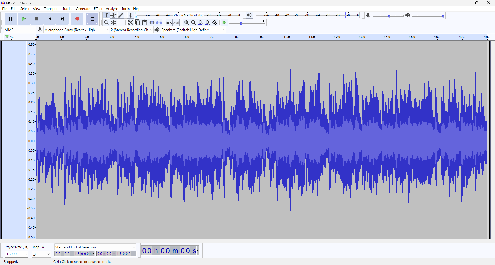
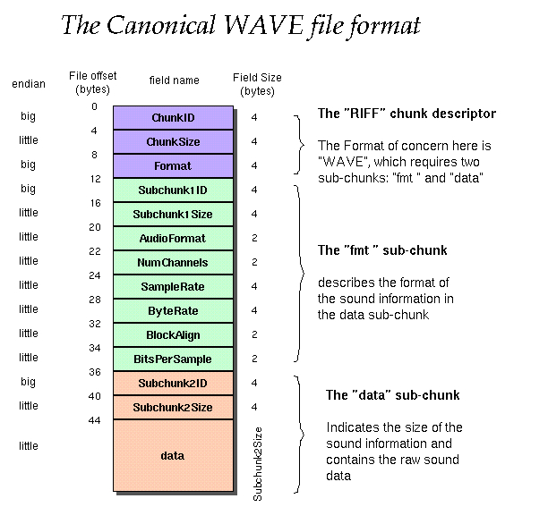
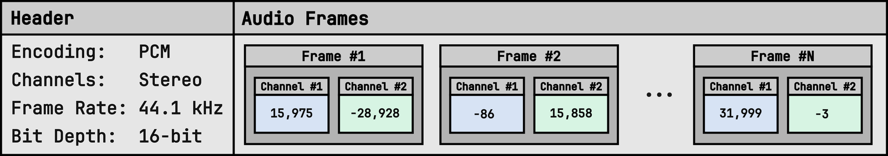
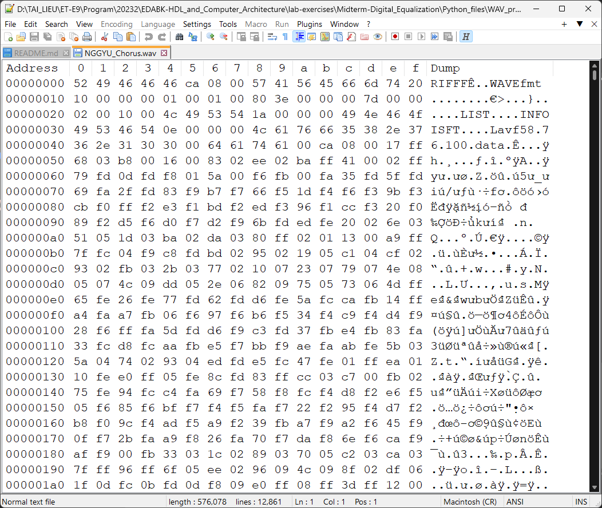

# Digital Equalization Using Verilog
Verilog project for a 8 Band Audio Equalizer implement on FPGAs

## 1. SPEC
```
Thiết kế bộ cân bằng âm thanh. 
Chi tiết về bộ Equalizer:  Audio equalizer based on FIR filters. | controlpaths.com

Đầu vào: Âm thanh được lấy mẫu với tần số 16Khz, độ rộng bit là 16 bit.
Đầu vào: 8 hệ số khuếch đại cho 8 băng tần số cần cân bằng
Đầu ra: Tín hiệu âm thanh ra. 
Kết quả cần báo cáo:
Độ trễ từ đầu vào đến đầu ra. 
Số cell FPGA cần sử dụng.

1)Cách mô phỏng chứng minh mạch hoạt động đúng
  a. Dùng python đọc file wav, vẽ đồ thị phổ của file wav
  b. Tạo file đầu vào là file text với mỗi hàng là 1 mẫu âm thanh lưu là 1 số HEX 16 bit
  c. Testbench đọc file text âm thanh đầu vào vào mảng bộ nhớ 16bit và đưa vào mạch. 
  d. Testbench lấy đầu ra của mạch và lưu vào file text output.txt mỗi hàng 1 là giá trị mẫu âm thanh 
  e.Dùng python đọc file output.txt và chuyển thành file wav, vẽ đồ thị phổ
  f. Dùng python tạo file outout_python.txt bằng cách dùng các hàm của python để tạo ra bộ Equalizer. So sánh kết quả output.txt với file output_python.txt

2)Tổng hợp mạch bằng FPGA báo cáo các resource cần sử dụng: số cell logic, số LUT, số DSP, số RAM
```
[Audio equalizer based on FIR filters. | controlpaths.com](https://www.controlpaths.com/2021/06/28/audio-equalizer-based-on-fir-filters/)


## 2. File WAV
Trong dự án lần này thì chúng tôi sẽ thực hiện chủ yếu trên file nhạc dưới đây:


https://github.com/Tbthanh/Midterm-Digital_Equalization/assets/90943148/ce053341-9a6d-4a55-820e-a7a66433de0b


### 2.1. Cấu tạo
#### 2.1.1. Sóng âm (Waveform) trong WAV
Ta đi tìm hiểu về phần sóng (wave) trong WAV trước. Một sóng âm thanh có thể được biểu diễn bởi ba tham số:
 - Biên độ: là độ mạnh của sóng âm, ta hay coi nó là độ to của âm thanh.
 - Tần số: là nghịch đảo của bước sóng hoặc số dao động mỗi giây, tương ứng với âm sắc (độ trầm bổng - cao thấp).
 - Pha:  là điểm trong chu kỳ mà sóng bắt đầu, thường tai người không thể để ý được.
Dạng sóng của file nhạc trên trong phần mềm Audacity có dạng như sau:

Trong ảnh trên thì trục hoành hay Ox là biểu diễn về thời gian, còn Oy hay trục tung biểu diễn về biên độ của sóng âm thanh. Hình ảnh trên có thể cho ta một cái nhìn hoặc cảm nhận tổng quan về file nhạc mà chúng ta sẽ làm việc với nó và nghiên cứu về nó ở dạng số hoá.

#### 2.1.2. Cấu tạo của file WAV
Tài liệu tham khảo:

  1.[Reading and Writing WAV Files in Python](https://realpython.com/python-wav-files/#understand-the-wav-file-format)
  
  2.[WAVE PCM soundfile format](https://ccrma.stanford.edu/courses/422-winter-2014/projects/WaveFormat/).

Ảnh dưới đây là cấu trúc dữ liệu cơ bản của WAV theo bytes:


Và ảnh dưới đây cũng là cấu trúc nhưng được trìu tượng hoá cho dễ hiểu:


Qua hai ảnh trên thì chúng ta cùng nhìn qua file nhạc bằng mã hex:


Các bạn có thể đọc tài liệu tham khảo 2 để hiểu thêm về phần mã hex ở header file WAV. Dưới đây tôi sẽ trình bày về một vài tham số đặc trưng phải quan tâm khi làm dự án này:
- <b>encoding</b>: Cách mã hoá (0x10 tại 00000010-0)
  <b>=> PCM</b> 
- <b>NumChannels</b>: Số kênh âm thanh (0x10 tại 00000010-6)
  <b>=> mono (Đơn âm sắc)</b>
- <b>BitsPerSample</b>: Số byte cho mỗi mẫu âm thanh (chưa xác định trong mã hex)
  <b>=> 2 bytes (16 bit)</b>
- <b>frame_rate</b>: Tần số mẫu (số mẫu âm thanh trên giây)
  <b>=> 16 KHz (16000 mẫu/giây)</b>
- <b>num_frames</b>: Số frame âm thanh
  <b>=> Tuỳ file</b>
- <b>duration = num_frames / frame_rate</b>: Thời lượng (giây)
  <b>=> Tuỳ file</b>
- <b>is_signed</b>: Giá trị có dấu hay không có dấu
  <b>=> Có dấu</b>
- <b>is_integer</b>: Giá trị nguyên hay thực
  <b>=> Nguyên</b>
- <b>is_fixedpoint</b>: Giá trị dấu phẩy tĩnh hay dấu phẩy động (nếu là số thực)
  <b>=> Không tĩnh không động</b>
- <b>...</b>


### 2.2. Tương tác với file WAV
#### 2.2.1. Lorem ipsum
Lorem ipsum

#### 2.2.2. Lorem ipsum
Lorem ipsum

## 3. Lorem ipsum
Lorem ipsum

### 3.1. Lorem ipsum
#### 3.1.1. Lorem ipsum
##### 3.1.1.1. Lorem ipsum
Lorem ipsum dolor sit amet, consectetur adipiscing elit, sed do eiusmod tempor incididunt ut labore et dolore magna aliqua. Ut enim ad minim veniam, quis nostrud exercitation ullamco laboris nisi ut aliquip ex ea commodo consequat. Duis aute irure dolor in reprehenderit in voluptate velit esse cillum dolore eu fugiat nulla pariatur. Excepteur sint occaecat cupidatat non proident, sunt in culpa qui officia deserunt mollit anim id est laborum.
